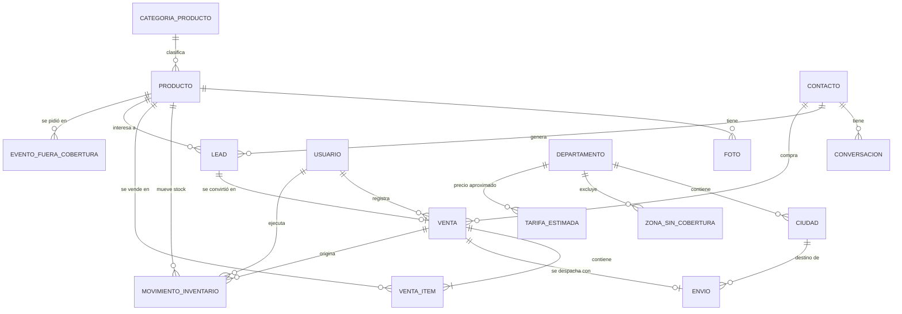

# Modelo de datos — LuxeBorealCRM

> **v1 · estado: aprobada (2026-09-25).** Fuente de verdad del diseño de datos: se decide
> aquí primero y después se refleja en `prisma/schema.prisma` (Fase 01). Parte del diseño del
> usuario en el prototipo (`ChatLuxeCRM/prisma/schema.prisma` desde la línea 90 y
> `ChatLuxeCRM/MODELO_DATOS.md`); cada cambio está justificado en §9. Arranque limpio: se toma la
> estructura, **ningún dato** del prototipo (P7).

## 1. Convenciones

| Tema | Regla | Motivo |
|---|---|---|
| Llaves primarias | `id uuid` v7, tipo nativo de Postgres (ADR-0007) | Ordenado por tiempo (índices compactos), no expone conteos |
| Llaves naturales | `departamento.id`, `ciudad.id` (códigos DANE), `parametro.clave` | Estables y oficiales |
| Consecutivos legibles | `venta.numero` (autoincremental, único, no PK) | Para decirle al cliente "pedido 152" |
| Nombres | Prisma en camelCase; tablas y columnas en snake_case (`@@map` / `@map`) | Igual que el prototipo |
| Dinero | `Int` en pesos colombianos; nunca `Float` | Sin errores de redondeo |
| Porcentajes | `Decimal(5,2)` | Ej. `5.00` |
| Estados | enums nativos de Postgres | La base rechaza valores inválidos |
| Auditoría mínima | `creado` y `actualizado` en toda tabla que se edita | Saber cuándo cambió algo |
| Negocio | un solo negocio, sin `cuenta_id` (ADR-0006) | |
| Mensajes | **no** se guarda el contenido de las conversaciones; Chatwoot es la fuente (P3) | Privacidad, sin duplicar |

### Ajustes de la Fase 01 al bajar el modelo a Prisma (D12 de `design.md`)

Aparecieron al escribir `prisma/schema.prisma`; se registran aquí primero, como pide
`openspec/config.yaml` §design, y el usuario los ve al aprobar el diseño de la fase.

| # | Ajuste | Decisión |
|---|---|---|
| 1 | Generación de ids | La hace el **cliente Prisma** (`@default(uuid(7))`), confirmado en ejecución en la Fase 01 (T2): `prisma validate` lo acepta, la migración generada **no** trae `DEFAULT` en la columna `id`, y un `create()` real devuelve un id con nibble de versión `7`. Postgres 16 no tiene `uuidv7()` nativo; un `INSERT` en SQL crudo MUST traer su propio `id` |
| 2 | Marcas de tiempo | `timestamptz(3)` en Postgres (`@db.Timestamptz(3)` en Prisma, porque `DateTime` sin `@db` sería `timestamp(3)` sin zona); `creado`/`actualizado` llevan `@default(now())` como red de seguridad para SQL crudo y herramientas, pero **la aplicación las escribe explícitamente desde el `Clock` inyectado** (regla crítica 6 de `CLAUDE.md`); sin `@updatedAt` |
| 3 | `conversacion.version` | `int`, **default `0`** |
| 4 | `uso_llm.costo_estimado_usd` | **`decimal(12,6)`** (§7 decía solo "decimal") |
| 5 | Defaults | Solo los que este documento ya fija (`activo`, `orden`, `stock`, `stock_minimo`, `acepta_contacto`, `peso_min_g`, `contraentrega_disponible`, `es_portada`) más los técnicos: `version = 0`, `intentos = 0`, las fechas de creación/recepción con `now()` y `outbox.proximo_intento` con `now()`. **Sin default para estados de negocio** (`conversacion.estado`, `lead.estado`, `venta.estado`, `envio.estado`, booleanos de `lead`): los fija el caso de uso de su fase, no el esquema |
| 6 | `ON DELETE` no especificado en este documento | Geografía: `Restrict` siempre, incluidas las FK opcionales, porque en `zona_sin_cobertura` y `tarifa_estimada` el `NULL` *significa* "todo el departamento" o "nacional" y borrar el catálogo DANE no es una operación normal. `venta.contacto_id`, `venta.usuario_id`, `envio.venta_id` y `movimiento_inventario.usuario_id`: `Restrict` (son registros contables; los usuarios se desactivan, no se borran, y un `SetNull` violaría el `CHECK` del ajuste 7). `uso_llm.conversacion_id`, `venta.lead_id` y `evento_fuera_cobertura.producto_id`: `SetNull` (permiten borrar un contacto o un producto sin arrastrar historial de costo/ventas) |
| 7 | `CHECK (cantidad > 0)` en `movimiento_inventario` | Se hace cumplir en la base la frase de §6 "siempre positiva; el signo lo da `tipo`", con una restricción `CHECK` escrita a mano (Prisma no la expresa por sí solo) |
| 8 | `evento_entrante.origen`, `outbox.tipo` | `text` (§8 no les define un enum: sus valores los definen las fases 04-05 que los escriben, no el esquema) |

## 2. Mapa global

Zonas: **catálogo** (producto, categoría, foto, parámetros), **envíos** (geografía, cobertura,
tarifas estimadas), **atención** (contacto, conversación, lead, horario), **operación**
(usuario, inventario, venta, envío) y **técnica** (inbox, outbox, uso de LLM).

## 3. Catálogo

### `categoria_producto`
| Columna | Tipo | Nulo | Nota |
|---|---|---|---|
| `id` | uuid | no | PK |
| `nombre` | text | no | único; duplicados por tildes/mayúsculas se rechazan en código |
| `orden` | int | no | default 0 |
| `activo` | bool | no | default true; se desactiva, no se borra |
| `creado`, `actualizado` | timestamptz | no | |

### `producto`
| Columna | Tipo | Nulo | Nota |
|---|---|---|---|
| `id` | uuid | no | PK |
| `sku` | text | no | único; `SKU-XXXX`, llave de la hoja y del enlace `wa.me` |
| `categoria_id` | uuid | sí | FK → `categoria_producto`, restrict |
| `nombre` | text | no | ≤ 24 caracteres (listas de WhatsApp) |
| `descripcion_corta` | text | no | ≤ 72 caracteres |
| `descripcion_larga` | text | no | |
| `precio_cop` | int | no | |
| `activo` | bool | no | default true |
| `peso_gramos`, `largo_mm`, `ancho_mm`, `alto_mm` | int | sí | peso facturable (§4) |
| `stock` | int | no | default 0; **caché** del ledger, se escribe en la misma transacción que el movimiento |
| `stock_minimo` | int | no | default 0; alerta en el back office |
| `clave_collage` | text | sí | archivo del collage pregenerado |
| `fotos_hash` | text | sí | evita regenerar fotos sin cambios al importar |
| `creado`, `actualizado` | timestamptz | no | |

Índices: `activo`, `categoria_id`.

### `foto`
| Columna | Tipo | Nulo | Nota |
|---|---|---|---|
| `id` | uuid | no | PK |
| `producto_id` | uuid | no | FK → `producto`, cascade |
| `orden` | int | no | |
| `clave_archivo` | text | no | ruta o clave en el almacenamiento, sin asumir disco local |
| `es_portada` | bool | no | default false |
| `angulo` | text | sí | qué muestra la foto: `frente`, `lateral_izquierdo`, `lateral_derecho`, `detalle` o `uso` (validado en código, Fase 08b); nulo = sin etiquetar |
| `origen_url` | text | sí | enlace de Drive en la última importación |
| `creado`, `actualizado` | timestamptz | no | |

### `parametro`
| Columna | Tipo | Nulo | Nota |
|---|---|---|---|
| `clave` | text | no | PK (natural) |
| `valor` | jsonb | no | validado en código por un registro tipado por clave |
| `actualizado` | timestamptz | no | |

Claves conocidas: `horario_atencion`, `recargo_contraentrega_pct` (5), `factor_volumetrico` (4000),
`transportadoras`, `aviso_datos`, `nombre_asesor`, `mensaje_handoff`,
`mensaje_handoff_fuera_horario`, `mensaje_cierre_captura_datos`, `mensaje_fuera_cobertura`,
`mensaje_error_llm`, `mensaje_espera_handoff` (Fase 05), `mensaje_techo_gasto`,
`mensaje_pedir_texto_audio` y `mensaje_imagen_no_procesada` (Fase 07a, R12),
`llm_techo_mensual_usd` y `llm_estado_techo` (Fase 06; esta última la escribe el gateway, no el
negocio).

**Textos fijos del agente (Fase 07a, AGT3, R15).** `mensaje_pedir_texto_audio`,
`mensaje_imagen_no_procesada`, `aviso_datos`, `mensaje_handoff` (dentro del horario de atención) y
`mensaje_handoff_fuera_horario` (fuera de él) son texto plano que el agente envía sin pasar por el LLM.
Si la fila no existe o está en blanco se usa un texto de respaldo (los del prototipo, P31) definido en
un solo lugar, `agente/infraestructura/prisma/repositorio-parametro-agente-prisma.ts`; el negocio los
reemplaza sin desplegar.

**Políticas del negocio (`politica_<tema>`).** Cada fila `politica_<tema>` es una política editable
(contra entrega, devoluciones, garantía…): el tema son minúsculas sin acentos, dígitos y guion bajo, y el
valor es un texto de hasta 1.200 caracteres. Agregar un tema es agregar una fila, sin tocar el código.
`politica_contra_entrega` tiene un texto de respaldo aprobado si no está configurada. Las consulta
`ConsultarPolitica` (CAT12); la Fase 07 la expone como la herramienta `consultar_politica`.

**`recargo_contraentrega_pct` es un dato interno** (Fase 13, total de la venta): el bot nunca dice el
porcentaje al cliente, solo que el recargo «se suma al total de tu compra» (política de contra entrega).

## 4. Envíos (rediseñado con el usuario, P4)

Cómo funciona el negocio: se envía a **casi todo el país**; el precio del envío **no es fijo** —
el bot solo puede dar un **rango aproximado**, y el valor real lo confirma Interrapidísimo al
despachar. Si el pago es contraentrega, se suma un **recargo del 5 %** que **paga el cliente**.

### `departamento` y `ciudad` (catálogo DANE, sin cambios)
| Tabla | Columna | Tipo | Nota |
|---|---|---|---|
| `departamento` | `id` | text | PK, código DANE de 2 dígitos (`05`) |
| `departamento` | `nombre` | text | único |
| `ciudad` | `id` | text | PK, código DANE de 5 dígitos (`05001`) |
| `ciudad` | `departamento_id` | text | FK → `departamento` |
| `ciudad` | `nombre` | text | único por departamento |

Se siembran desde el listado oficial (divipola); no se editan a mano.

### `zona_sin_cobertura` — NUEVA
Lista **corta** de exclusiones. Si el destino no está aquí, hay cobertura.

| Columna | Tipo | Nulo | Nota |
|---|---|---|---|
| `id` | uuid | no | PK |
| `departamento_id` | text | no | FK → `departamento` |
| `ciudad_id` | text | sí | FK → `ciudad`; vacío = todo el departamento |
| `motivo` | text | sí | "San Andrés: solo por avión", etc. |
| `creado`, `actualizado` | timestamptz | no | |

Único: `(departamento_id, ciudad_id)` (con `NULLS NOT DISTINCT` para que no haya dos filas de
"todo el departamento").

### `tarifa_estimada` — reemplaza a `tarifa_envio`
Lo que el bot **cita**: un rango, nunca un precio exacto.

| Columna | Tipo | Nulo | Nota |
|---|---|---|---|
| `id` | uuid | no | PK |
| `departamento_id` | text | sí | FK; vacío = **tarifa nacional por defecto** |
| `ciudad_id` | text | sí | FK; solo si esa ciudad es distinta de su departamento |
| `peso_min_g` | int | no | default 0 |
| `peso_max_g` | int | sí | vacío = sin tope. Con una sola fila 0-∞ el peso no importa |
| `rango_min_cop`, `rango_max_cop` | int | no | lo que dice el bot |
| `dias_min`, `dias_max` | int | no | tiempo de entrega aproximado |
| `contraentrega_disponible` | bool | no | default true |
| `creado`, `actualizado` | timestamptz | no | |

**Búsqueda** (la hace el backend, nunca el LLM):
1. ¿El destino está en `zona_sin_cobertura`? → sin cobertura: se responde con
   `mensaje_fuera_cobertura` y se registra `evento_fuera_cobertura`.
2. Si no, la tarifa más específica que calce con el peso facturable: **ciudad exacta →
   departamento → nacional**.
3. Peso facturable = `max(peso real, largo × ancho × alto / factor_volumetrico)` (se conserva el
   cálculo del prototipo). Producto sin peso = 0 g.

Carga mínima para operar: **una sola fila** nacional (sin departamento, sin ciudad, peso 0-∞).
Las excepciones se agregan solo donde el envío sea notablemente más caro.

### `evento_fuera_cobertura` (sin cambios)
`id`, `producto_id?`, `departamento_texto`, `ciudad_texto?`, `departamento_id?`, `ciudad_id?`,
`fecha`. Guarda lo que escribió el cliente y, si se pudo traducir, el código DANE: sirve para
decidir si ampliar la cobertura.

## 5. Atención

### `contacto` — CAMBIA (sin teléfono como PK, P1)
| Columna | Tipo | Nulo | Nota |
|---|---|---|---|
| `id` | uuid | no | **PK propia** |
| `chatwoot_contact_id` | int | sí | único; identidad multicanal (Chatwoot une WhatsApp, IG, Messenger) |
| `telefono` | text | sí | único; normalizado sin `+` (`573001234567`). Vacío si llegó por un canal sin teléfono |
| `nombre` | text | sí | |
| `documento` | text | sí | único; cédula. Nunca en logs |
| `correo` | text | sí | nunca en logs |
| `telefono_alterno` | text | sí | si da otro número de contacto |
| `direccion`, `localidad` | text | sí | captura fuera de horario |
| `departamento_texto`, `ciudad_texto` | text | sí | tal como lo escribió el cliente |
| `ciudad_id` | text | sí | FK → `ciudad`, si el backend pudo traducirlo |
| `ultimo_producto_id` | uuid | sí | FK → `producto`, set null |
| `acepta_contacto` | bool | no | default false (opt-in para campañas futuras) |
| `creado`, `actualizado` | timestamptz | no | |

### `conversacion` — reemplaza a `estado_conversacion`
Una fila por **conversación de Chatwoot** (sesión), no por cliente. Sin mensajes.

| Columna | Tipo | Nulo | Nota |
|---|---|---|---|
| `id` | uuid | no | PK |
| `contacto_id` | uuid | no | FK → `contacto`, cascade |
| `chatwoot_conversation_id` | int | no | único |
| `canal` | enum `canal_conversacion` | no | `whatsapp`, `instagram`, `messenger`, `web`, `otro` (de `conversation.channel`) |
| `estado` | enum `estado_atencion` | no | `bot`, `handoff_pendiente`, `humano`, `pausado` |
| `expira_control_en` | timestamptz | sí | cuándo vuelve al bot (antes `expira_humano_en`) |
| `version` | int | no | bloqueo optimista de las transiciones (ADR-0003); default `0` |
| `creado`, `actualizado` | timestamptz | no | |

### `lead` — CAMBIA (embudo, P2)
| Columna | Tipo | Nulo | Nota |
|---|---|---|---|
| `id` | uuid | no | PK |
| `contacto_id` | uuid | no | FK → `contacto`, cascade |
| `conversacion_id` | uuid | sí | FK → `conversacion`, set null |
| `producto_id` | uuid | sí | FK → `producto`, set null |
| `temperatura` | enum | no | `frio`, `tibio`, `caliente` |
| `senales` | jsonb | no | `string[]` validado al leer |
| `resumen` | text | no | sin datos personales (ni teléfono, cédula, correo ni dirección) — P15 |
| `derivado` | bool | no | la escala determinista confirmó y se avisó |
| `capturado_fuera_horario` | bool | no | |
| `estado` | enum `estado_lead` | no | **NUEVO**: `nuevo`, `en_atencion`, `ganado`, `perdido`, `descartado` |
| `motivo_perdida` | text | sí | **NUEVO** |
| `notificado_en`, `recordatorio_en` | timestamptz | sí | |
| `creado`, `actualizado` | timestamptz | no | |

Ciclo: `nuevo` (lo creó el bot) → `en_atencion` (un asesor lo tomó) → `ganado` (hay venta
enlazada) / `perdido` (con motivo) / `descartado` (no era lead real — sirve para calibrar la escala).

### `excepcion_horario` (sin cambios)
`fecha` date PK, `motivo?`. Festivos y cierres planeados.

## 6. Operación (back office, fases 11-13)

### `usuario`
`id` uuid, `email` único, `nombre`, `password_hash`, `rol` (`admin`, `asesor`), `activo`,
`ultimo_acceso?`, `creado`, `actualizado`.

### `movimiento_inventario` — CAMBIA
| Columna | Tipo | Nulo | Nota |
|---|---|---|---|
| `id` | uuid | no | PK |
| `producto_id` | uuid | no | FK, restrict |
| `tipo` | enum | no | `entrada`, `salida`, `ajuste`, `devolucion` |
| `cantidad` | int | no | siempre positiva; el signo lo da `tipo` (`CHECK cantidad > 0`, escrito a mano en la migración) |
| `saldo_despues` | int | no | |
| `motivo` | text | sí | |
| `venta_id` | uuid | sí | FK, set null |
| `origen` | enum `origen_movimiento` | no | **NUEVO**: `usuario`, `sistema` |
| `usuario_id` | uuid | sí | **CAMBIA a opcional**: obligatorio solo si `origen = usuario` (check) |
| `creado` | timestamptz | no | |

Regla dura: el ledger es la verdad; `producto.stock` es caché, en la misma transacción.

### `venta` — CAMBIA
`id` uuid, `numero` (consecutivo único), `contacto_id` FK, **`lead_id?` FK (NUEVO, P2)**,
`usuario_id` FK, `estado` (`pendiente`, `confirmada`, `cancelada`, `rechazada`), `canal`
(`whatsapp`, `marketplace`, `instagram`, `presencial`, `otro`), `metodo_pago` (`contraentrega`,
`transferencia`, `efectivo`), `notas?`, `confirmada_en?`, `cerrada_en?`, `creado`, `actualizado`.
No guarda dinero: `total = Σ(cantidad × precio_unitario) + recargo_contraentrega`.

### `venta_item` (sin cambios)
`id`, `venta_id` FK cascade, `producto_id` FK restrict, `descripcion` (copia congelada),
`cantidad`, `precio_unitario_cop` (congelado).

### `envio` — sin cambios de estructura
`id`, `venta_id` único, `transportadora`, `numero_guia?`, `estado` (`pendiente`, `despachado`,
`entregado`, `rechazado`), `porcentaje_contraentrega?` (copiado del parámetro, ej. 5.00),
`recargo_contraentrega_cop` (lo paga el cliente), **`costo_transportadora_cop?` = precio real
confirmado por Interrapidísimo al despachar**, `direccion`, `localidad` (copias), `ciudad_id` FK,
`creado`, `actualizado`.

## 7. Técnica — NUEVAS

| Tabla | Columnas clave | Para qué |
|---|---|---|
| `evento_entrante` | `id`, `origen` text, `id_externo`, `payload` jsonb, `recibido_en`, `procesado_en?`, `intentos`, `error?`; único `(origen, id_externo)` | Inbox: ningún evento aceptado se pierde; el único es la deduplicación (ADR-0004). Se purga a los 30 días |
| `outbox` | `id`, `tipo` text, `clave_idempotencia` text **único, NOT NULL** (Fase 04, D11), `payload` jsonb, `creado`, `enviado_en?`, `intentos`, `proximo_intento`, `error?` | Efectos externos (Telegram, status en Chatwoot) con reintento (ADR-0004); `clave_idempotencia` es la idempotencia por paso (B5) — inserción `ON CONFLICT DO NOTHING`, la construye el dominio que agrega la fila, nunca el esquema. `payload` puede llevar una clave efímera con el contenido saliente mientras la fila está pendiente (borrada al cerrar la fila; ver ADR-0004, "Aclaración (Fase 04)") |
| `uso_llm` | `id`, `conversacion_id?`, `proveedor`, `modelo`, `tokens_entrada`, `tokens_salida`, `tokens_cache`, `costo_estimado_usd` `decimal(12,6)`, `latencia_ms`, `exito`, `creado`; índice por `creado` (Fase 06, D10) | Costo por turno y techo de gasto (P9). El agregado mensual del techo filtra por `creado`, por eso el índice; un intento que nunca llegó al proveedor (techo alcanzado, circuito abierto) usa `proveedor = 'pasarela'` |

`payload` de `evento_entrante` guarda el evento de Chatwoot **redactado** (P15): ids, tipo de evento y
metadatos, **nunca** el texto del mensaje, adjuntos ni datos personales. Para reprocesar, el contenido
se relee de la API de Chatwoot (`GET …/conversations/{id}/messages`). Se purga y nunca se usa como
historial.

## 8. Enums

`estado_atencion`, `canal_conversacion` (nuevo), `temperatura_lead`, `estado_lead` (nuevo),
`tipo_movimiento`, `origen_movimiento` (nuevo), `estado_venta`, `estado_envio`, `canal_venta`,
`metodo_pago`, `rol_usuario`.

## 9. Cambios respecto al prototipo y por qué

| # | Cambio | Por qué | Decisión |
|---|---|---|---|
| 1 | PK `uuid` v7 en vez de `cuid()` texto | Tipo nativo (16 bytes vs ~25), ordenado por tiempo | ADR-0007 |
| 2 | `contacto.id` propia; teléfono único opcional | El teléfono como PK es un antipatrón: cambia, se repite en otros canales, no existe en Instagram/Messenger | P1 |
| 3 | `chatwoot_contact_id` en `contacto` | Chatwoot ya une a la misma persona entre canales; no se construye una tabla de identidades propia | P1, ADR-0005 |
| 4 | `estado_conversacion` → `conversacion` por sesión, con `version` | El traspaso a humano es por conversación, no por cliente (ADR-008 del prototipo); Postgres fuente de verdad | ADR-0003 |
| 5 | `lead.estado`, `motivo_perdida`, `venta.lead_id` | Medir cuántos leads terminan en venta | P2 |
| 6 | `tarifa_envio` → `zona_sin_cobertura` + `tarifa_estimada` con FK DANE | Casi todo el país tiene cobertura; el precio es aproximado; elegir de lista evita errores de tipeo | P4 |
| 7 | `contacto` y `evento_fuera_cobertura` guardan el texto del cliente + el código DANE traducido | El LLM nunca produce códigos; el backend traduce | P4 |
| 8 | `parametro.valor` jsonb | Hoy el horario es JSON dentro de un texto y los números son texto | revisión 2.4 |
| 9 | `movimiento_inventario.origen` + `usuario_id` opcional | Movimientos automáticos sin usuario humano | revisión 2.6 |
| 10 | `foto.clave_archivo`, `producto.clave_collage` | No atarse a disco local | revisión 2.7 |
| 11 | `creado`/`actualizado` donde faltaban | Auditoría básica | revisión 2.8 |
| 12 | `evento_entrante`, `outbox`, `uso_llm` | Inbox/outbox (A8) y costo por turno | ADR-0004, P9 |
| 13 | `outbox.clave_idempotencia` (único, `NOT NULL`) | Idempotencia por paso (B5): un `idRespuesta`/`idOperacion` estable entre reintentos evita duplicar el efecto externo | Fase 04, D11, ADR-0004 |
| — | Se conservan sin cambios | Dinero en `Int`, precio congelado en `venta_item`, ledger de inventario, `envio` separado, catálogo DANE, sin tabla de variantes, sin totales en `venta` | diseño del usuario |

## 10. Fuera a propósito

Historial de mensajes (P3, Chatwoot), multiempresa (ADR-0006), tabla de pagos, variantes, envíos
parciales, subcategorías, costo del producto/margen — mismos motivos del `MODELO_DATOS.md` del
prototipo §9.
